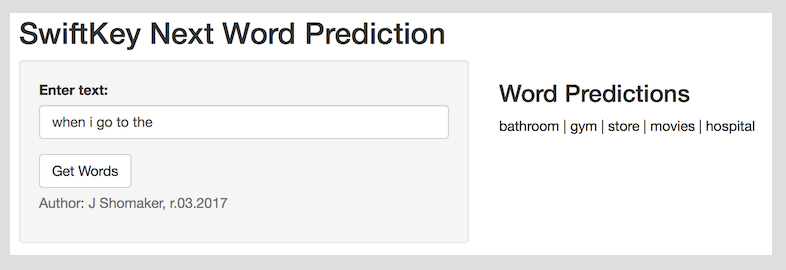

```{r setup, include=FALSE}
knitr::opts_chunk$set(echo = FALSE, warning = FALSE, message = FALSE)
```

## SwiftKey NLP Project Overview
The Capstone project for the Johns Hopkins Data Science (JHDS) program focuses on natural language processing (NLP). The assignment utilizes a use case defined by SwiftKey, a European mobile application vendor, to predict "next words" for mobile phone users as they communicate via texting.

SwiftKey provided raw text phrases from three different sources - Twitter posts, blogs, and news - in four countries. For this exercise, we only utilized the U.S. datasets. In short, the assignment consisted of:

- <b>Data Exploration.</b> Understanding the dimensions and complexity of the raw data.
- <b>Data Cleansing.</b> Applying numerous methods and libraries to clean text data.
- <b>Common Phrases.</b> Creating a set of most frequently used phrases (ngrams).
- <b>Prediction Model.</b> Leveraging the ngram frequencies to predict next words.
- <b>Shiny App.</b> Building a simple app for users to enter phrases and get 'next words'.


## Data Exploration & Cleansing
Cleansing and "tokenizing" text has distinct challenges from cleansing structured numeric data. As you can imagine, language differences, misspellings, cryptic abbreviations, punctuation mistakes require numerous methods to detect and cleanse.

- <b>Raw Data.</b> Approx. 200MB each of U.S. Twitter, blogs, and news.
- <b>Samples.</b> 20% random each of blogs, news. 10% of Twitter.

I found that text can be cleansed as traditional text records, and as text records within documents within a multi-document structure with meta-data called a corpus. I recommend exploring TM, SnowballC, qdapRegex, dplyr, tidyr, NLP, stringi, and tidytext. Tidytext was very efficient for generating ngrams.

NLP is a primary focus of current AI research, generating significant innovation in new R methods and libraries. As a result, I iterated through a variety of methods specifically written to manage corpus and raw text files.


## Back-Off Model
As with the data exploration and cleansing phase, I iterated extensively on various prediction methods. In the end, I found that my original Markov back-off was most accurate and efficient (fast). The model starts by taking the last three words of the user's input, running a search in the quadgram and selecting the most common (highest frequency) result. If no results, the model then proceeds to the trigram (against last two words), then bigram (using the last input word). Up to five alternative words are returned.

Instead of relying on the back-off sequencing alone, I also tested an integrated search (all ngram tables together), computing a probability to determine the predicted words, apply 'factors' for different ngrams, and also investigated smoothing. In the end, my model is driven by two principles:

- <b> ngram Length Critical. </b> A match in a quadgram is vastly superior to a bigram result. There was no incremental accuracy benefit by combining ngrams.
- <b> Frequency Trumps. </b> The text initially suggested smaller samples (1%-2%) to drive statistical significance and speed in the model. Instead, I found that taking larger 10X samples (10%-20%) yielded more frequency delineation in more common phrases (context) (and more accuracy), and then I could drive speed by eliminating all ngrams where frequency=1 (sparse).

This approaches produces model response times in the 9ms-13ms (very fast) and very high match rates for (a) shorter input phrases < 5 words, and (b) more "common" requests. Longer phrases with more subtle context returned just 60%-70% within the five returned word predictions.


## Shiny App


The app was published to shinyapp.io here: https://jshomaker1.shinyapps.io/nlp_predict2/

If it's not actively running in .io, the app takes 15 seconds to load the three ngrams utilized by the model, but then, subsequent inputs only require 9ms-13ms for to deliver five potential word predictions. The app is responsive to the "Get Words", button, so that edits to the input only generate new predictions once the button is pressed. If the input area is cleared, an error message is shown.

You can access all of my R scripts, ngram data files, R presentation files, and the Shiny app (both separate and unified) in my GitHub file:
https://github.com/jshomaker/capstone_nlp
